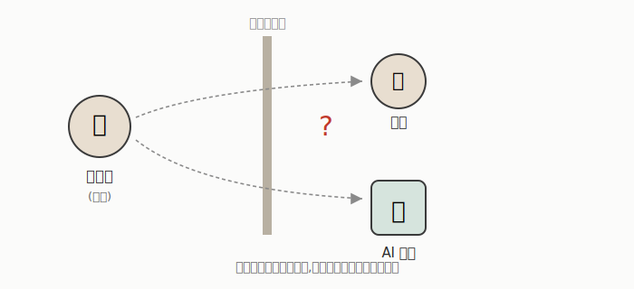
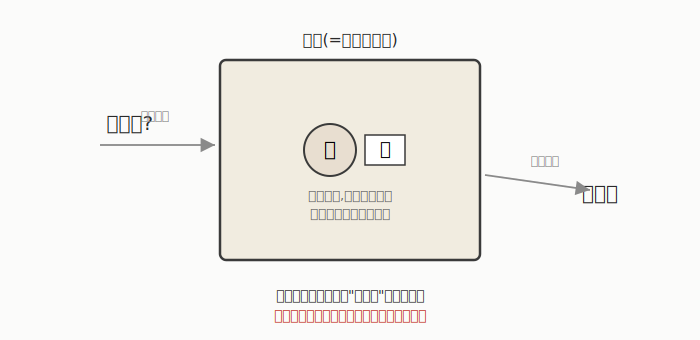

# 什么是人工智能?—— 一个连定义都吵不清楚的领域

AI 这门学科从诞生那天起,连"什么是 AI"这个最基本的问题都没有统一答案。历史上关于 AI 的定义,可以分成两个维度交叉出的四类:

|              | 像人一样(Humanly) | 理性地(Rationally) |
|--------------|-------------------|---------------------|
| **思考(Thinking)** | 让机器拥有"心智"(Haugeland, 1985) | 研究推理的计算模型(Charniak & McDermott, 1985) |
| **行动(Acting)**   | 让机器做人类做得好的事(Kurzweil, 1990) | 设计智能体的行为(Poole et al., 1998) |

- **像人一样思考**:关注机器内部过程是否"像"人脑——决策、解题、学习这些人类思维活动能不能被自动化。
- **理性地思考**:关注"推理"本身的计算规律,不管过程像不像人脑,只要符合逻辑/概率的推理规则就算数。
- **像人一样行动**:只看外部表现,机器的行为让人分不清是不是人类做的——图灵测试就属于这一派。
- **理性地行动**:现代 AI 领域最主流的立场——AI 是"智能体(agent)设计"的研究,只要智能体在给定目标下做出合理的行为,不纠结它是否"真的在思考"。

一句话总结:AI 既是一门**科学**(假设"智能就是计算",这个假设可能是错的),也是一门**工程**(设计能"work"的系统,不纠结哲学问题)。一个常用的类比是飞机制造和空气动力学的关系:你不需要完全理解鸟类飞行的所有奥秘,也能造出会飞的飞机。AI 工程很多时候也是这个逻辑——先让系统"能用",理论解释可以后补。

这里还藏着一个基石性的假设,叫 **Church-Turing 论题**:如果一个问题能用普通编程语言(只要有赋值、条件判断、循环这些基本结构)写出程序算出来,它就是"可计算的"。但这留下一个值得琢磨的反问——**有没有可能存在"不可计算"、却依然能产生智能的过程?** 比如大脑的某些底层机制、生物演化、蚂蚁群体或鸟群的集体行为,这些复杂系统展现出的"智能",未必能简单归约成一段程序。这个问题至今没有定论。

---

## 图灵测试:用"行为"绕开"思考是什么"这个死循环

**模仿游戏(Imitation Game)** 的设定:一个人类提问者,同时和一台机器、一个人对话(只通过文字,看不到对方),如果提问者无法可靠地分辨谁是机器,机器就算通过测试。

图灵在 1950 年论文里的态度其实很务实:他认为"机器能否思考"这个问题本身**没有意义**,争论它没有价值;未来人们会很自然地说机器在"思考",而不会觉得这句话有矛盾。这其实是图灵在回避"思考"这个词的哲学定义之争,转而用一个**可操作的行为标准**替代它。

### 两个经典的"欺骗案例"

- **Eliza**:一个模拟心理治疗师的聊天程序(1960 年代),靠简单的模式匹配和反问技巧(比如把用户的陈述句改写成"你觉得...?"),就能让人产生"它理解我"的错觉。这其实证明了**表现得像**和**真的理解**之间可以有巨大的鸿沟——放在今天,这个警示对判断聊天机器人/大语言模型的"智能程度"依然适用。

- **SHRDLU**:一个操作虚拟积木世界的程序,能理解指代("拿起那个"里的"那个"指什么)、进行简单推理("哪个比我手里的更窄")。相比 Eliza 的取巧,SHRDLU 需要维护一个关于积木世界的内部模型,展现的是更接近"真实"的语言理解能力。

这两个例子放在一起,提出了一个至今仍然核心的问题:**多少"智能表现"是靠取巧的模式匹配,多少是靠真正的内部表示和推理?**——这正是当下评价大语言模型时依然在争论的问题。

---

## 反对 AI 可能性的三个经典论证

比起罗列"计算机做不到什么"的清单(这类清单历史上屡屡被打脸——曾经"AI 不可能下赢人类"这类说法早已被推翻),更值得琢磨的是三个更硬核的哲学论证。

### 1. 中文房间(Searle, 1980)

想象一个完全不懂中文的人,坐在一个房间里,只靠一本详细的规则手册(相当于程序),把递进来的中文字符按规则转换成另一些中文字符递出去。

房间外的人看来,这个房间"能流利地用中文对话"(能通过图灵测试),但房间里的人**根本不理解中文**。塞尔的论证结构是:这个人的行为完全等价于一段计算机程序 → 这个人不理解中文 → 所以计算机程序也不可能真正"理解"语言,即使它能通过图灵测试。

这个论证直接挑战了"物理符号系统假设"(Newell & Simon, 1976 提出的经典假设:一个能正确操作符号的系统就拥有产生智能行为的充分必要条件)——中文房间说的是:光靠符号操作(语法),不足以产生真正的理解(语义)。留下的开放追问是:那大脑里的"理解"到底在哪里?如果大脑的理解也不过是神经元层面的符号操作,这个论证的说服力就会被削弱。

**放到今天看**:这个争论在大语言模型时代变得格外现实——ChatGPT 这类模型本质上也是在做极其复杂的符号(token)预测,它们展现出的"理解",到底是真理解还是超大规模的模式匹配?这仍然是哲学和 AI 学界争论不休的问题,并没有因为技术进步而被解决。

### 2. 哥德尔不完备定理式论证(Lucas 1961, Penrose 1989)

哥德尔证明了:任何"强大到能表达算术"的形式系统,都存在一个系统内部无法证明真假的命题。Lucas 和 Penrose 认为:人类能凭直觉"看出"这个命题是真的,但一个形式系统(即计算机程序)做不到这一点——所以人类思维超越了任何形式系统。

这个论证争议很大,主流学界普遍不认同,常见的反驳是:人类的"看出"本身也可能只是另一种不可靠的直觉,并不能证明人类真的超越了形式系统的能力边界。

### 3. 大脑替换实验(Searle 1992 / Moravec 1988)

思想实验:假设把大脑里的神经元,一个一个替换成功能完全等价的电子器件。行为不会有任何变化(因为每次替换都功能等价),但——塞尔认为意识会**逐渐消失**;莫拉维克则认为结果反而是一台**有意识的机器**。

这里留下几个至今没有答案的问题:意识是智能的必要条件吗?意识和行为之间有因果联系,还是意识只是不影响行为的"副现象"?意识能被科学方法研究吗?——这些问题对做 AI 工程真的重要吗?

**这三个论证的共同点**:它们都在质疑"行为等价 = 心智等价"这个假设。如果你认同"能做到就算智能",这些论证很难反驳你;如果你认为"内部体验"才是智能的核心,它们会让你对纯粹的行为主义判断产生怀疑。今天多数 AI 工程实践选择绕开这些争议、先把问题定义得可操作——但这不代表问题被解决了,只是暂时被搁置。

---

## 现实检验:AI 现在到底能做到什么?—— 一份更新过的清单

几十年前的教材经常会问"以下哪些事 AI 现在能做到",这份清单本身就是观察技术进步的一个很好的标尺。按今天(2026 年年中)的状态重新审视:

- ✅ **下棋、围棋**——早已远超人类顶尖水平,这个问题在 21 世纪初就已经解决。
- ✅ **图像分类**——深度学习的强项,已经是成熟的商业化技术。
- ✅ **实时语音翻译**——相比十几年前有质的飞跃,主流产品已经能做到接近同声传译的效果,虽然在专业术语、方言、语气微妙之处仍有差距。
- ✅/⚠️ **自动驾驶**——在高速公路、结构化城市道路等场景已大规模商业化落地(如部分城市的无人驾驶出租车),但在极端复杂的非结构化路况(比如拥堵混乱的老城区、恶劣天气山路)依然是难题,还没有做到"哪里都能开"。
- ⚠️ **数学定理证明**——AI 辅助证明和发现新数学结果已有实际案例(比如近年一些数学竞赛级问题、几何证明领域的进展),但独立提出深刻的全新理论仍然罕见,更多是"辅助"而非"主导"。
- ❌ **写一个真正好笑的笑话/故事**——语言模型能模仿幽默的套路和结构,但"真正好笑"依赖对语境、观众、文化的精微把握,这方面依然明显弱于人类。
- ⚠️ **专业领域的法律/医疗建议**——AI 已经能提供有相当参考价值的初步建议,但在需要为后果承担责任、处理复杂个案的场景下,仍然需要人类专业人士把关。

**这份清单最大的变化是**:曾经被视为"AI 很难做到"的很多事(实时翻译、自动驾驶、复杂图像理解),如今已经部分或大规模实现;但"创造力""责任判断""长程规划中的鲁棒性"这些维度,依然是明显的短板——这和几十年前的判断其实高度一致,只是难度的"门槛线"整体往前推移了。

---

## 一个真实案例:从新闻文本里自动抽取"事件"

这里用一个真实的应用案例,来说明"实用 AI 系统"通常长什么样。

**目标**:输入一篇新闻(比如"一群西方游客在阿富汗西部遭塔利班武装分子伏击"),系统自动识别出——谁(行为者)、做了什么(动作)、对谁做的(目标),并把提到的组织/人物链接到一个结构化的知识库里(比如识别出"塔利班武装分子"对应知识库里的"塔利班"这个组织实体,还能关联到它的别名,比如"阿富汗伊斯兰酋长国")。

传统方案会把这个任务拆解成一条**流水线**,每个环节依赖不同领域的技术:

1. 大规模文本流的存储与处理(数据库/大数据技术)
2. 分句、词性标注、句法解析(自然语言处理)
3. 定义并维护一个领域知识库/本体(知识表示)
4. 从大量样本中归纳抽取规则(机器学习)
5. 对识别出的事件按重要性排序(机器学习)

每一层都需要精心设计,工程量很大,但优点是**每一步都可控、可解释**——你能清楚看到系统为什么把某句话判断为"伏击事件",判断依据是哪条规则。

**今天的核心问题是**:这一整条流水线该做的事,能不能直接交给一个大语言模型一步到位完成?这正是当前 AI 领域的核心张力所在——精细设计、可解释的传统流水线,对比端到端、黑箱但更省工程量的大模型方案。这场"传统符号方法 vs. 端到端大模型"的博弈,至今仍在很多实际应用场景中持续进行。

---

## 总结:工程狂奔,科学缓行

关于 AI 现状,有一个概括至今依然成立,而且值得反复咀嚼:

**工程角度**:很多具体子问题上都有巨大进展(大多依赖大规模数据);系统融合了人类专业知识与机器学习;技术趋向于走向更复杂的系统,以及规模越来越大的神经网络。

**科学角度**:我们离"一般性智能理论"依然很遥远;离"复现人类在很多领域的推理能力"依然很遥远;离"真正理解大脑如何工作"依然很遥远。

换句话说:**AI 作为工程学科正在高速前进,但作为科学学科,我们对"智能到底是什么"这个根本问题,理解程度并没有随之同步提升。** 这也解释了为什么前面那些提出于几十年前的哲学论证(中文房间、哥德尔式论证)至今仍未被彻底"解决"——工程上的成功,并不等于科学上的理解。这场"能做"和"懂了"之间的落差,恰恰是这个领域最耐人寻味的地方。
