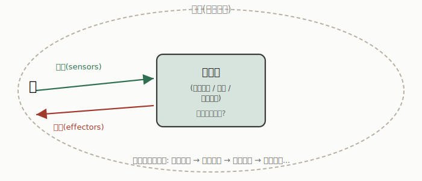
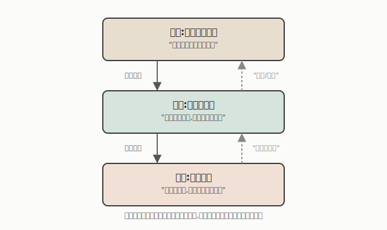

# 什么是智能体(Agent)?

"Agent" 这个词现在因为大语言模型(比如各种"AI Agent"产品)又火了一波,但它其实是 AI 领域一个很老、很基础的概念。理解经典意义上的"智能体"是什么,能帮你更清楚地判断——今天说的"AI Agent"到底是真的新东西,还是老概念换了个新包装。

---

## 一、直觉定义:能感知、能行动的实体

最朴素的定义:**一个通过传感器感知环境、通过效应器(执行装置)对环境施加影响的实体。**

- **人类作为智能体**:传感器是眼睛、耳朵、皮肤触觉;效应器是手、腿等身体部位。
- **机器人作为智能体**:传感器是超声波/红外测距仪、摄像头;效应器是电机、机械臂。

这个定义可以套用的范围其实很宽——人、狗、蠕虫、恒温器,甚至一家公司,是不是都能算"智能体"?这本身就是一个有意思的开放问题:**智能体的范围到底应该划多宽?**

## 二、更严格一点:五个特征

要把"智能体"和普通的"程序"或者"设备"区分开,通常会要求同时满足这几个特征:

- **情境化(Situated)**:处在一个不断变化的环境里,而不是孤立地处理静态输入。
- **反应性(Reactive)**:能及时响应环境的变化。
- **自主性(Autonomous)**:能自己控制自己的行为,不需要每一步都被人操控。
- **主动性(Proactive)**:表现出目标导向的行为,而不只是被动响应。
- **通信能力(Communicating)**:能和其他智能体协调、交流(这一条常打问号,因为不是所有智能体都需要这个能力)。

一个常被拿来举例的思想实验是青蛙:青蛙能精准地伸舌头捕捉飞过的昆虫,但青蛙"知道"自己在做什么吗?它有没有关于世界的内部表示,还是纯粹靠反射式的感知-动作映射?这提醒我们:**"智能行为"不一定需要"内部知道自己在做什么"**——这对智能体的工程设计有直接影响,有些任务用简单的反射式规则就够了,不需要维护复杂的世界模型。

## 三、描述一个智能体需要哪几个要素?

要说清楚一个具体的智能体,通常需要说清四件事(这组要素在教材里常被称为 **PEAS**:Percepts / Actions / Goals / Environment):

| 要素 | 含义 |
|------|------|
| **感知(Percepts)** | 智能体通过传感器获得的输入 |
| **行动(Actions)** | 智能体通过效应器能做出的输出 |
| **目标(Goals)** | 智能体的目标或性能评估标准 |
| **环境(Environment)** | 智能体所处的世界 |

举几个例子把这张表具象化:

| 类型 | 目标 | 环境 |
|------|------|------|
| 医疗诊断系统 | 让病人恢复健康、降低医疗成本 | 病人、医院 |
| 卫星图像分析系统 | 正确分类识别图像内容 | 来自轨道卫星的图像 |
| 自动驾驶出租车 | 安全、快速、合法、舒适地送达,同时让利润最大化 | 道路、其他车辆、行人、乘客 |
| 足球机器人 | 进球得分 | 有球和其他机器人的球场 |

最广义地说,一个智能体可以被抽象成**一个从"感知历史"映射到"行动"的函数**。

这里有两个值得区分的概念:

- **理想理性智能体(Ideally rational agent)**:总是做出预期能最大化某个性能指标的行动——但智能体本身可能并不知道这个性能指标具体是什么(这是 Russell & Norvig 教材里的经典表述)。
- **资源受限智能体(Resource-bounded agent)**:受限于自己的感知、计算和内存能力,只能做出"足够好"而非"最优"的决策——这本质上是一种工程上的权衡取舍。这个概念放到今天特别贴切:任何实际部署的 AI 系统(包括大模型)都要在"准确度"和"响应速度/成本"之间做权衡,道理是相通的。

---

## 四、环境本身也需要被刻画

同一套智能体设计思路,套用在不同"环境"里,难度可能天差地别。经典的环境分类维度有:

- **完全可观测 vs 部分可观测**:传感器能否获取环境的完整(相关)状态。
- **确定性 vs 随机性**:下一个状态是否完全由当前状态和智能体的行动决定。
- **回合制 vs 序贯**:智能体的经验是否可以划分成互不影响的"回合"(回合制不需要提前规划未来)。
- **静态 vs 动态**:智能体在思考的时候,环境会不会自己发生变化。
- **离散 vs 连续**:感知和行动的可能取值是有限、清晰定义的,还是连续的。

**为什么这组分类值得记住**:很多时候,一个任务"难不难做 AI",不完全取决于任务表面看起来复杂不复杂,而是取决于它在这几个维度上的位置。比如下棋是"完全可观测 + 确定性 + 离散"的,相对好做;而现实世界的自动驾驶是"部分可观测 + 随机性 + 动态 + 连续"的组合,这也是为什么自动驾驶比下棋难得多——不是规则更复杂,而是环境本身的性质更"恶劣"。

---

## 五、内部该怎么表示世界?—— 表示方式的取舍

智能体要对世界建模,选择什么样的"表示(representation)"同样是个需要权衡的设计决策,好的表示应该:

- 足够丰富,能表达解决问题所需要的知识;
- 尽量贴近问题本身:紧凑、自然、易维护;
- 便于高效计算:既能利用问题的特点获得计算上的优势,也能在精度和计算时间/空间之间做权衡;
- 能够从人的经验、数据、过往案例中获取。

用国际象棋举例,同一个棋局可以用完全不同粒度的方式表示:

- **状态(States)**:把整盘棋看成一个具体的局面(可能的局面数量是天文数字)。
- **特征(Features)**:提取局面的关键特征,比如"是否存在一个可以晋升的兵"。
- **命题(Propositions)**:用逻辑结构描述局面,比如把局面拆解成"位置""棋子""关系"这样的逻辑单元。

一般规律是:**表示越复杂,推理能力越强,但需要的推理过程也越复杂**——这本质上和现代机器学习里"特征工程 vs 端到端学习"的取舍是同一类问题:你是自己精心设计特征,还是让模型自己从原始数据里学出表示?

---

## 六、智能体的"决策逻辑"可以分几个层次

不同智能体做决策依据的信息量不一样,大致可以分成一个复杂度递增的谱系:

- **反射式智能体**:直接把当前感知映射到行动,不维护关于世界的复杂内部状态。
- **基于目标的智能体**:仅凭当前状态描述往往不足以决定该做什么,还需要参考自己的目标(可能涉及搜索和规划)——比如决定"下一步该往哪走"要考虑"我的目的地在哪"。
- **基于效用的智能体**:不仅有目标,还能对不同的世界状态给出**偏好程度**的排序(效用函数),从而在多个都能达成目标的方案里,选出"最令自己满意"的那一个,而不只是"能达成目标就行"。

这三者的关系可以理解成:反射式智能体只回答"现在该做什么";基于目标的智能体多问了一句"这样做能不能达成我的目的";基于效用的智能体又多问了一句"在所有能达成目的的方案里,哪个最好"。

---

## 七、分层架构:把复杂决策拆成不同的时间尺度

真实机器人系统往往不会用单一逻辑处理所有决策,而是采用**分层架构(layered architecture)**——一套控制器层级,层与层之间协作:

以一个配送机器人为例:

- **顶层**负责执行整体配送计划(“按顺序访问所有目的地”),运行在较慢的时间尺度上;
- **中层**负责导航和避障(“朝目标点前进,遇到障碍物就绕开”),响应速度要快很多;
- **底层**负责实时控制(“根据触须传感器的信号,直接决定电机怎么转向”),需要毫秒级响应。

这种架构的关键特点是:**每一层用不同的表示、不同的时间尺度工作;下层可以直接对上层的指令进行调整或"覆盖"**——比如中层还在执行"前往目标点"的指令时,如果底层的触须传感器突然检测到障碍物,可以立即插入一个避让动作,而不需要先上报给顶层再等指令下达。这种设计思路,在今天的自动驾驶、无人机系统里依然是主流范式。

---

## 八、BDI 智能体:让"心智状态"变得可计算

**BDI(Belief-Desire-Intention,信念-愿望-意图)** 是一套很有影响力的智能体架构,来自哲学家 Michael Bratman 关于人类实践推理的理论(1987 年提出),后来被 AI 领域工程化、变成了可编程的架构:

- **信念(Beliefs)**:智能体对世界的显式表示——"我认为世界是什么样的"。
- **愿望(Desires)**:智能体偏好达成的状态——"我想要什么"(不要求互相一致)。
- **目标(Goals)**:智能体已经选定要去追求的那部分愿望(这部分必须彼此一致,不能自相矛盾)。
- **意图(Intentions)**:智能体已经选定并承诺执行的行动——它们会引出"如何实现"的进一步思考、限制之后能做的选择、并驱动实际行为。

值得强调的是:BDI 里的"信念、愿望、意图"全部是**功能性定义**的——也就是说,这些词听起来很"拟人化",但在 BDI 架构里,它们都被严格定义成了计算意义上的数据结构和状态转换规则,没有掺杂任何"机器到底有没有真心智"这类哲学争论(可以理解成上一篇提到的"X Factor 论证"完全被绕开了)。

**PRS(Procedural Reasoning System,过程推理系统)** 是 BDI 思想的一个经典实现,它特别适合这样的场景:能提前制定出合理的计划、需要保持承诺的连续性、需要对情况做出快速反应、计算资源有限、同时又要跟得上世界变化的节奏。它的核心循环大致是:根据当前的事件、信念、目标、意图生成候选选项 → 从中挑选 → 更新意图 → 执行 → 获取新的外部事件 → 清理已完成或已不可能实现的信念/目标/意图 → 循环往复。

**和今天的联系**:如果你了解现在流行的 LLM Agent 框架(比如 ReAct、AutoGPT 这类"感知-思考-行动"循环的设计),会发现它们的核心循环和几十年前的 PRS 惊人地相似——都是"观察环境 → 生成候选行动 → 选择 → 执行 → 根据反馈调整"这一套逻辑。区别主要在于:BDI/PRS 时代,"信念"和"选项生成"依赖手工编写的符号规则;而今天的 LLM Agent 用一个大语言模型来充当"生成候选选项"和"推理"这部分——本质上是用一个更通用、更模糊但更灵活的组件,替换掉了原来那套需要人工精心设计的符号系统。这也是为什么理解经典智能体理论,对理解今天的"AI Agent"热潮依然很有帮助:很多设计上的权衡(比如响应速度 vs 深思熟虑、承诺的一致性、资源限制),几十年前就已经被讨论过一遍了。

---

## 小结

智能体理论要回答的核心问题,其实可以归纳成几层:

1. **它是什么**(感知+行动的实体,具备情境化、自主性等特征)
2. **它面对什么**(环境的六大维度决定了任务的本质难度)
3. **它怎么表示世界**(状态、特征、命题——表达力和计算效率的权衡)
4. **它怎么决策**(反射式 → 基于目标 → 基于效用,复杂度递增)
5. **它怎么组织内部结构**(分层架构、BDI 这类让复杂决策变得可管理的设计模式)

这套框架是几十年前为了研究机器人和符号 AI 系统提出的,但放到今天重新审视"AI Agent"这个概念时,依然是一套很扎实的分析工具——技术实现方式变了(从符号规则到大语言模型),但这些底层的设计权衡并没有消失。
