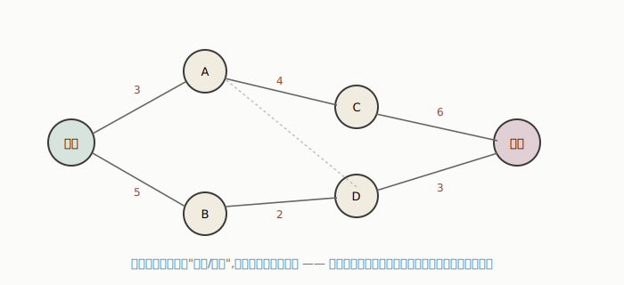
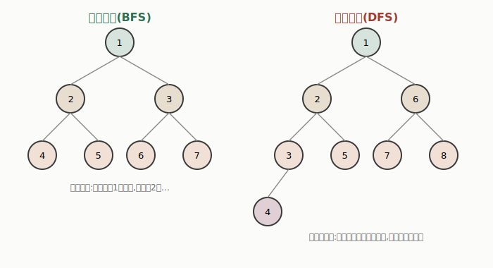

# 如何让机器解决问题:状态空间搜索

很多看起来完全不相关的问题——走迷宫、拼图、下棋、规划快递路线、设计芯片布局——本质上都可以用同一套框架来描述和求解,这套框架就是**状态空间搜索(State Space Search)**。这是经典 AI 里最基础、也是至今依然到处能看到影子的一套思想。

---

## 一、一个引子:怎么从 A 地开车到 B 地?

想象你人在一个陌生城市,需要开车到另一座城市。直觉上你会问几个问题:我现在在哪?可以往哪几个方向走?每个方向要花多少代价(时间、油费)?终点是哪?——这几个问题,恰好对应了状态空间搜索问题的标准形式化定义。

## 二、把"解决问题"这件事形式化

任何一个状态空间搜索问题,都可以拆解成这几个要素:

- **状态空间(State space)**:从初始状态出发,通过任意一串动作能够到达的所有状态的集合。
- **初始状态**:问题开始时所处的状态(可能不止一个)。
- **转移方式**:通常用两种方式描述——**操作符(Operators)**,即智能体可以采取的一组动作,描述在当前状态下执行某个动作后会到达什么状态;或者**后继函数(Successor function)** s(x),直接给出从状态 x 经过一步动作能到达的所有状态集合。
- **目标状态**:希望到达的状态(也可能不止一个)。
- **路径代价(Path cost)**:一串转移动作的总代价,用来评估一个解的好坏(这一项主要用于"最优化"类问题——不只是要找到一个解,还要找到"最好"的那个解)。

## 三、一个简单的例子:井字棋的形式化

用井字棋(tic-tac-toe)来具体感受一下这套框架:

- **状态**:3×3 棋盘上 X 和 O 的排列方式
- **操作符**:在空格上放一个 X(或 O)
- **目标状态**:某一方的三个棋子连成一线
- **路径代价**:0(因为井字棋只关心能不能赢,不关心走了几步、每一步"贵不贵")

这个例子也提示了一个容易被忽略的点:**路径代价不是每个问题都需要的**——对于井字棋这种只看"能不能赢"、不看"赢得辛不辛苦"的问题,路径代价直接设成零就行了。

## 四、同一个问题,几种完全不同的解法——这揭示了什么?

一个很有启发性的思路演进:面对"设计一个能玩井字棋的程序"这个任务,历史上出现过好几种完全不同风格的解法,拿来对比能看出很多门道。

**朴素查表法**:把所有可能的局面和对应的最佳走法直接列成一张表存起来。优点是运行起来极快(直接查表),缺点是这张表大到根本不现实,也完全没有"扩展性"——换一个稍微不同的棋盘规格,整张表就得重新做。

**幻方(Magic Square)技巧**:这是个很巧妙的做法——把 1 到 9 这九个数字按幻方(每行每列每条对角线之和都相等,都是 15)的方式填入棋盘格子。这样一来,判断"是否连成一线"就变成了一个简单的算术问题:检查自己已经占据的格子对应的数字里,有没有两个数字之和加上第三个数字等于 15。这个技巧非常高效,但**极度依赖这个具体问题的巧妙结构**——换成四子棋或者五子棋,这套技巧完全用不上了。

**基于估值的搜索**:枚举每一种可能的走法会导致的局面,给每个局面估算一个"离获胜有多近"的分数,选分数最高的走法。这个方法运行起来比前两种慢,但**能推广到很多不同的问题上**,不需要针对每个具体游戏设计专门的技巧。

**这组对比真正想说明的问题是**:*针对具体问题设计的技巧(比如幻方)往往速度极快,但几乎没有可推广性;而通用的搜索方法牺牲了一部分效率,换来的是能套用到一大类问题上的能力。* 这其实是算法设计里一个反复出现的核心权衡——今天做机器学习工程也会遇到同样的选择:是为你的具体任务手工设计特征/规则(快但不通用),还是用一个更通用的模型/算法(慢一点但能迁移到别的任务上)?

## 五、现实世界里的搜索问题

这套框架不是玩具游戏专属的,大量真实世界的问题本质上都是搜索/优化问题,比如:

- **路径规划**:机器人导航、机票行程规划、网络路由
- **旅行商问题(TSP)**:比如规划电路板自动钻孔机的移动路径,让总移动距离最短
- **VLSI 芯片布局设计**
- **装配顺序规划**:复杂产品的组装调度、生产流程控制
- **带约束的调度问题**:快递配送、产品配送、故障维修派单

这些大多是最优化问题,但值得注意的是——**传统运筹学的数学方法并不总是有效**,当问题规模大、约束复杂、目标函数不光滑时,搜索类方法往往更实用。

## 六、状态空间可以有多大?——以 8 数码难题为例

**8 数码难题(8-puzzle)**是一个经典例子:一个 3×3 的棋盘上有 8 个编号方块和一个空格,每次可以把和空格相邻的一个方块移动到空格里,目标是把方块拼成指定的顺序。

从一个初始局面出发,每走一步(上/下/左/右移动空格),就会分裂出好几个新的局面,这些局面又能继续分裂——**状态空间的规模会随着步数指数级增长**。这也是为什么"搜索算法怎么聪明地探索这棵越长越大的树",会成为整个领域的核心问题。

## 七、问题会变得更复杂:智能体对世界的了解程度

上面的框架默认智能体对自己的状态和动作效果一清二楚,但现实中往往没这么理想,大致可以分成几个复杂度递增的情形:

- **单状态问题**:智能体从一个已知的确切状态出发,并且清楚知道执行某个动作后会到达哪个唯一状态。
- **多状态问题**:智能体对当前所处状态的了解有限,只能把可能性缩小到一个状态集合,而不能确定唯一状态。
- **偶发性问题(Contingency problem)**:智能体不完全知道动作的效果(或者环境中还有别的事情在发生),必须在执行过程中持续感知,动态调整搜索空间。
- **探索性问题**:智能体对动作效果(甚至状态本身)完全没有先验知识,只能靠不断试验去摸索。

这组分类和"环境的可观测性/确定性"是同一套思路的延伸——**智能体对世界了解得越少,问题就越难,需要的策略也越复杂**。标准搜索算法能够处理单状态和多状态问题(只是复杂度会上升),但面对偶发性和探索性问题,往往需要引入额外的机制(比如强化学习里的"试错"思路,某种程度上正是为了应对探索性问题而生的)。

## 八、容易混淆的两个概念:"状态"不等于"节点"

这是个很多人容易搞混、但很重要的区分:

- 状态(State)是问题本身的一部分,它只是"世界当前长什么样"这一份描述。
- 节点(Node)是搜索算法内部用来组织搜索过程的数据结构,除了状态本身,还包含:它的父节点、到达它所用的操作、它在搜索树里的深度、以及到它为止的路径代价。

**状态本身没有"父节点""深度""路径代价"这些属性——这些是节点才有的。** 一个容易被忽略的推论是:**两个不同的节点完全可能对应同一个状态**——比如你绕了一大圈,又回到了之前到过的某个局面,这时候产生的是一个新节点(记录着不同的路径和深度),但它包裹的状态和之前某个节点是一样的。理解这个区别,对判断"要不要把这个状态标记为已访问过"这类搜索优化细节至关重要。

## 九、一个通用的搜索算法骨架

几乎所有搜索算法都可以套进同一个通用流程:

1. 用问题的初始状态,初始化一张"搜索图"
2. 不断循环:
   - 如果已经没有可扩展的候选节点了,返回失败
   - 按照某种"策略"从当前的候选节点(前沿节点)里选一个来扩展
   - 如果选中的节点已经是目标状态,返回这个解
   - 否则,扩展这个节点(生成它的所有后继),把新节点加入候选集合

**这个骨架里唯一的"可变部件"就是第 2 步里的"策略"**——不同的搜索算法(广度优先、深度优先、一致代价搜索等等)之间的全部区别,其实就在于这个策略选哪个节点来扩展。这是理解各种搜索算法的一个很好的切入点:与其死记每种算法的细节,不如先抓住"它们都是同一个框架,只是选节点的策略不同"这个核心。

## 十、几种经典的"盲搜索"策略

"盲搜索(Blind/Uninformed Search)"指的是这类算法在选择扩展哪个节点时,完全不利用关于问题的额外信息(比如"哪个方向更接近目标"这种直觉),纯粹按照搜索图本身的结构来决定顺序。

- **广度优先搜索(BFS)**:一层一层来,把当前深度的所有节点都扩展完,才去扩展下一层。好处是保证能找到"最浅"的解(如果每一步代价相等,这也是步数最少的解);代价是内存开销很大——需要同时保存指数级数量的节点。
- **一致代价搜索(Uniform Cost Search)**:每次都选"目前路径代价最小"的节点来扩展,而不是简单按深度。只要路径代价不会随着路径变长而"倒退"(专业说法是代价单调不减),这个策略保证能找到真正最优的解。有个容易踩的坑:必须在节点被"扩展"时才判断是否为目标,而不是在它刚被生成、加入候选集合时就判断——否则可能会错过真正代价更低的路径。
- **深度优先搜索(DFS)**:一路扎到底,先把一条分支走到最深处,再回头尝试别的分支。优点是占用内存少;缺点是如果某条分支很深甚至无限深,算法可能会在里面"迷路",即使解其实就在很浅的地方——**深度优先搜索既不保证一定能找到解,也不保证找到的是最优解**。
- **迭代加深搜索(Iterative Deepening)**:结合了两者的优点——像深度优先一样省内存,但每一轮都设一个逐渐增加的深度限制,一轮轮加深,直到找到解。看起来好像有很多重复计算(浅层节点被反复扩展),但由于每一层的节点数量是指数增长的,重复计算的部分占比其实很小——总的时间复杂度和广度优先是同一个数量级。**当你不知道解到底藏在多深的地方、又要控制内存开销时,迭代加深通常是最推荐的策略。**
- **双向搜索(Bidirectional Search)**:同时从起点和终点各自往中间搜索,直到两边"碰头"。如果解在深度 d 处,这种方法能把复杂度从指数级的 O(b^d) 降到大约 O(b^(d/2)) 的量级——效果非常显著,前提是你知道目标状态具体是什么、并且能反向搜索(有些问题反着搜并不容易)。

### 各策略的横向对比

| 策略 | 时间复杂度 | 空间复杂度 | 保证最优解? | 保证能找到解? |
|------|-----------|-----------|--------------|----------------|
| 广度优先 | O(b^d) | O(b^d) | 是 | 是 |
| 一致代价 | O(b^d) | O(b^d) | 是 | 是 |
| 深度优先 | O(b^m) | O(b^m) | 否 | 否 |
| 深度限制 | O(b^l) | O(b^l) | 否 | 仅当限制 l ≥ d |
| 迭代加深 | O(b^d) | O(b^d) | 是 | 是 |
| 双向搜索 | O(b^(d/2)) | O(b^(d/2)) | 是 | 是 |

*(b = 分支因子,d = 最浅解的深度,m = 搜索树最大深度,l = 深度限制)*

**看这张表最重要的一点**:这几种"盲搜索"策略,没有一种能同时做到"时间/空间开销低"又"保证找到最优解"——除了双向搜索(它有额外的前提条件)。这不是巧合,而是"完全不用问题相关信息"这个限制本身带来的代价。这也是为什么下一步(在后续内容里会讲到的"启发式搜索")会引入"利用问题特定信息来引导搜索方向",从而突破这个瓶颈——这是搜索算法发展的一条自然主线。

---

## 十一、这套思想在今天还有用吗?

状态空间搜索是六七十年前就成型的理论,但它的核心思想至今仍然活跃在很多地方:

- 手机地图导航背后的路径规划算法,本质上就是搜索(通常结合了更聪明的启发式策略)。
- AlphaGo/AlphaZero 这类下棋 AI,核心是**蒙特卡洛树搜索(MCTS)**与深度学习的结合——依然是"在一棵巨大的状态树里搜索"这套思路,只是用神经网络替代了人工设计的估值函数。
- 今天大语言模型里流行的"思维树(Tree of Thought)""多路径推理"等技术,本质上也是在一个由"可能的推理步骤"构成的空间里做搜索,选出最有希望走到正确答案的路径——只是这里的"状态"变成了一段文字,"操作符"变成了"生成下一步推理"。

理解经典搜索理论的价值在于:它提供了一套关于"如何在权衡时间、空间、最优性之间做选择"的基本词汇和分析工具,这些工具在任何"探索一个巨大可能性空间"的场景下都能派上用场——不管这个空间是棋局、路线,还是语言模型的推理路径。
